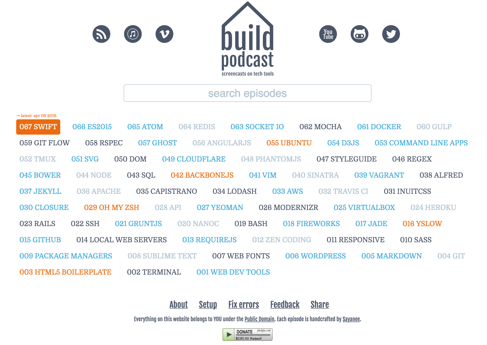

# Build Podcast [](https://gemnasium.com/sayanee/build-podcast) [](https://travis-ci.org/sayanee/build-podcast)

> [Build Podcast](http://build-podcast.com) is a screencast about technology tools :nut_and_bolt: :electric_plug: :battery: :abcd: :computer: for design and development. Each episode, [Sayanee](http://sayan.ee) will be creating a screencast that will take you through step-by-step in using one tool to build a little project, all in the fun spirit of hacking, creating and building stuff!

Related links: [Main website](http://build-podcast.com), [Twitter](http://twitter.com/buildpodcast), [RSS Feed](http://feeds.feedburner.com/BuildPodcastVideos), [Youtube](http://www.youtube.com/playlist?list=PL9wSRifxQqRrLalGxTs-8FmfftbueLk5u), [Vimeo](https://vimeo.com/channels/441355), [iTunes](https://itunes.apple.com/us/podcast/build-podcast-screencast/id538677863)



## Quick start

1. install dependencies

  ```sh
  $ bundle install && npm install
  ```
- start the website

  ```sh
  $ npm start
  ```

## Install

### For website

1. Install various packages:

  ```sh
  $ bundle install # for jekyll
  $ gem install vimeo tempfile json thor launchy # for vimeo script
  $ npm install # for assets and automation scripts
  $ brew install ffmpeg sox # for post-processing video and audio
  ```

### For tmuxinator

1. link tmux script `bp.yml` for starting up

  ```sh
  $ ln -s /Users/{username}/Workspace/path/to/folder/bp.yml /Users/{username}/.tmuxinator/bp.yml # create a symlink
  $ tmuxinator bp
  ```

### For recording screencast and post-processing

1. create `episode.json` in one up level of hierarchy

  ```sh
  $ cp automation/episode.sample.json ../episode.json
  # edit file episode.json accordingly
  ```
- symlink scripts `bp`, `norm` and `vimeo`

  ```sh
  $ ln -s /Users/{username}/Workspace/path/to/folder/automation/bp /Users/{username}/path/to/folder/bp
  $ ln -s /Users/{username}/Workspace/path/to/folder/automation/norm /Users/{username}/path/to/folder/norm
  $ ln -s /Users/{username}/Workspace/path/to/folder/automation/vimeo /Users/{username}/path/to/folder/vimeo
  ```
- install python packages
  1. [download python google data](https://code.google.com/p/gdata-python-client/downloads/list) and [install it](https://code.google.com/p/youtube-upload/wiki/Readme#Download_&_Install)
  - [download youtube-upload](https://code.google.com/p/youtube-upload/downloads/list) and [install it](https://code.google.com/p/youtube-upload/wiki/Readme#Download_&_Install)
  - install both packages with the following commands:

    ```sh
    $ tar xvzf {package}.tar.gz
    $ cd {package}
    $ sudo python setup.py install
    ```

### Setup dev.build-podcast in local

This is to display the introduction page at the start of each screencast.

1. edit `/etc/hosts`

  ```sh
  ...
  127.0.0.1 dev.build-podcast.com
  ...
  ```
- edit nginx config file `/usr/local/etc/nginx/nginx.conf`

  ```nginx
  http {
    ...
    include /usr/local/etc/nginx/sites-enabled/*;
    ...

    server {
      listen       80;
      server_name  dev.build-podcast.com;

      charset utf-8;
      add_header "X-UA-Compatible" "IE=Edge,chrome=1";
      index   index.html;

      location / {
        expires -1;
        add_header Pragma "no-cache";
        add_header Cache-Control "no-store, no-cache, must-revalidate, post-check=0, pre-check=0";
        root    /Users/{username}/path/to/build-podcast/start;
      }
    }
  }
  ```

## Development

This Github repository consists of sample code for each episode and the entire website for [Build Podcast](http://build-podcast.com).

When preparing the show notes in local machine, execute the following in the command line in git branch `master`:
 - **to build**:

   ```sh
   $ LANG="en_US.UTF-8" && LC_CTYPE="en_US.UTF-8" && jekyll build
   ```
 - **to add new posts**:  to start the [Jekyll](http://jekyllrb.com/) server with development configurations

   ```sh
   $ LANG="en_US.UTF-8" && LC_CTYPE="en_US.UTF-8" && jekyll serve --watch --config _dev_config.yml
   ```
 - **to edit css and javascript**: to start the [GruntJS](http://gruntjs.com/) continuous compilation for CSS and JavaScript

   ```sh
   $ grunt
   ```

If there's and error for invalid byte sequence in US-ASCII, try to reset the locale settings

```sh
LC_CTYPE="en_US.UTF-8"
LANG="en_US.UTF-8"
```

For quickly firing up all the above commands, use tmux:

```sh
tmuxinator bp
```

## Scripts

Automation with [scripts](https://github.com/sayanee/build-podcast/tree/master/automation):

1. Start a new episode: `bp new`
1. Open an existing episode: `bp open`
1. Record aa new episode: `bp record`
1. Publish a new episode: `bp pub`


## License

All content belongs to YOU under [CC0 1.0 Public Domain Dedication](http://creativecommons.org/publicdomain/zero/1.0/). You can copy, modify, distribute and perform the work, even for commercial purposes, all without asking permission.

## Donate

:sparkles: I buy :books: :chocolate_bar: :nut_and_bolt: :electric_plug: :battery: with the donated money :sparkles:

<a href='http://www.pledgie.com/campaigns/19089'></a>
